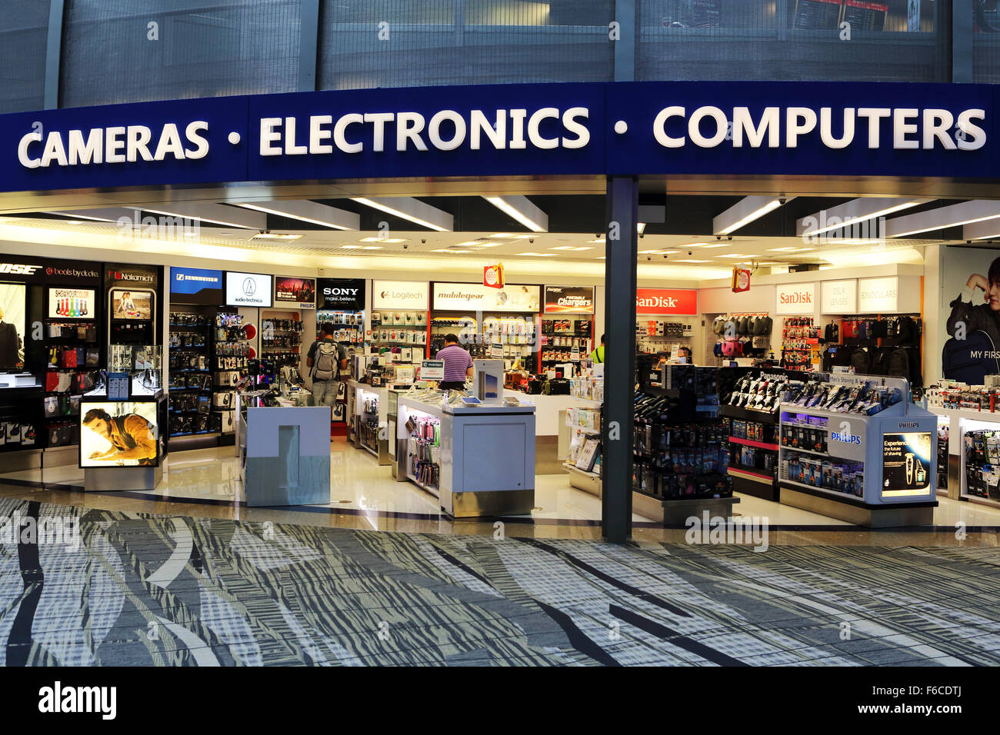

# Electronic Store Dashboard

---
## 📊 Project Overview
This Power BI project is an interactive and insightful dashboard designed to visualize and analyze key metrics for an imaginary electronics retail business,
**abc_store**. It provides a comprehensive view of sales trends, product performance, customer demographics, and regional distribution.
The aim is to answer crucial business questions, derive actionable insights, and support data-driven decision-making.

**_Disclaimer_**: _All datasets and reports in this project are based on a dummy dataset and do not represent any actual company, 
institution, or country. The purpose is solely to demonstrate the analytical and visualization capabilities of Power BI_.

---
## Problem Statement
1. Lorem
2. Lorem
3. Lorem

---
## 🔧 Tools and Technologies
- Power BI: Visualization and dashboard creation.
- Excel: Data cleaning and preparation.
- SQL: Querying and data extraction.
---
## 🚀 Key Features
- Sales Analysis: Monitor daily, monthly, and yearly sales performance.
- Product Insights: Identify best-selling products and underperforming items.
- Customer Demographics: Gain insights into customer segments by age, location, and preferences.
- Regional Performance: Explore revenue contributions from different geographical regions.
- Interactive Visualizations: Dynamic charts, graphs, and slicers for user interaction.
---
## 🛠️ Steps Taken
1. Data Cleaning: Processed and cleaned raw data for accuracy.
2. Exploratory Data Analysis (EDA): Uncovered trends and patterns in the data.
3. Dashboard Development: Built dynamic dashboards for key performance indicators (KPIs).
4. Optimization: Ensured scalability and user-friendliness.
## 📂 Dataset
- Source: [Provide dataset source, e.g., Kaggle or internal company data.]
- Details: Contains sales, product, customer, and regional data for an electronics store.
---
## 🖼️ Visualization
The Report Comprises of 2 Pages
- Sales Overview

- Regional Analysis

You can interact with the report [here](https://app.powerbi.com/groups/me/reports/bb616d57-f2b9-4262-ab91-ddc788618c83/ReportSection?experience=power-bi)
---
## 📈 Insights
- The most profitable product category is **Computers**.
- The highest revenue is generated from the **Kebbi State**.
- [Add 1-2 more insights derived from the dashboard.]

---
## 📌 How to Use
1. Download the `.pbix` file (if Power BI) or access the Tableau Public link.
2. Explore the dashboard using filters and slicers for customized insights.

---
## 🤝 Acknowledgements
- Data Source: [spreedsheet](https://docs.google.com/spreadsheets/d/1hH-5QVDV2iljBiTySlAPW6kONFHZuS8j/edit?usp=drivesdk&ouid=109333584567658221710&rtpof=true&sd=true)
